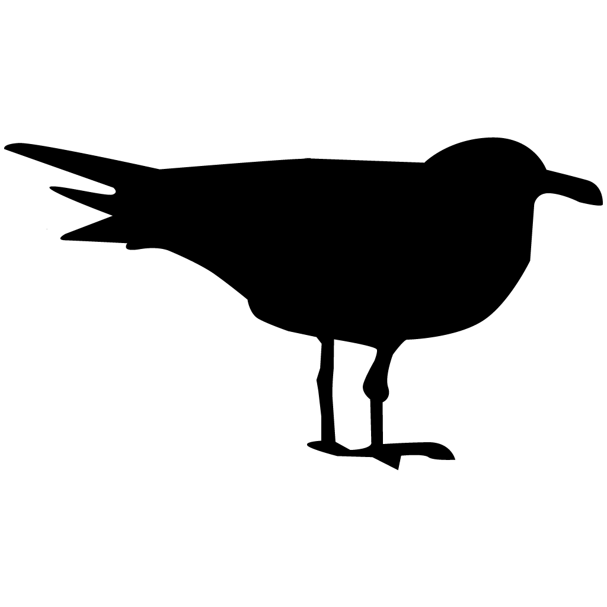
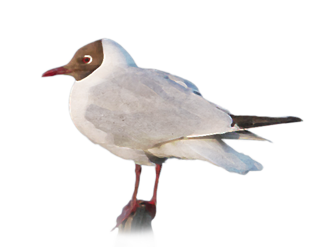

### What is a metapopulation ?        		   { width=6% } 
A metapopulation refers to a group of **spatially separated populations** of the same species which interact at some level. The application of metapopulation models is relevant to the study of population dynamics in **fragmented environments** or when breeders aggregate at sites and form colonies. This application aims to provide an interface that applies and illustrates a discrete metapopulation model whose characteristics can be chosen by the user.
The size of each population is determined by three processes: births, deaths and migration :

>   Nt+1 = Nt  + Birth - Death + Immigration - Emigration 

### Modelling a metacolony of Black-headed Gull   { width=8% } 

The model used in this application is placed in the context of modeling a Black-headed Gull (*Chroicocephalus ridibundus*) metacolony. The adults of this gregarious species come together in spring to breed in a colony. 

The environment provided by the colony is crucial for reproduction and depends on a number of factors: proximity to hunting areas, potential predators, etc. This context directly determines the reproductive success of adult gulls.  

In addition to the quality of the breeding sites, each colony is also characterized by a maximum carrying capacity **K**. Beyond this value, the adults cannot find the space they need to build a nest and are forced to emigrate. 

The dynamics of each colony is modeled in two stages: (i) the population's own growth, i.e. births and deaths, and (ii) migration.

#### Birth and death
In this example, the self-growth of a colony **i** is modeled in a discrete way according the **Beverton-Holt's equation** and depends on the quality of the colony which induces a reproduction rate **ri**. In addition, stochasticity is introduced into the model to incorporate variability linked to reproduction. Thus, after reproduction of the colony, the number of individuals is obtained by : 

$$
N_i(t+1) = \frac{N_i(t) \times R_0}{1 + \frac{N_i(t)}{M}}
$$

Where $R_0 = e^r$ and $M = \frac{K}{R_0-1}$. 

To take natural stochasticity into account the observed value of $N_{t+1}$ is sampled in a log-normal distrbution: 

$$
N^{obs}_i(t+1) \sim lognormal(log(N_i(t+1), \sigma)
$$

The standard deviation of the distibution ($\sigma$) was set at 0.1 on the log scale in this application. 

#### Migration
After the breeding season, the adults have the choice of staying in the colony or leaving it (post-reproductive dispersal).  The decision to emigrate depends on how saturated the colony is. If, after reproduction, the number of individuals exceeds the maximum carrying capacity **Ki**, then a number equal to the surplus will emigrate. In our example, all colonies have the same probability of being chosen by a migrant.
The number of emigrants $E_i(t)$ from colony i at time t is expressed as: 

$$
E_i(t) = m_i \times N_i(t) + max(0, N_i(t)-K_i)
$$

With $N_i(t)$ the number of birds at the colony i at t, $K_i$ its maximal carrying capacity and $m_i$ its migration rate. Migration rate is set to 0.1 for all the population. Then emigrants are equally shared by the other colony j, thus the number of immigrants is: 

$$
I_i(t) = \frac{((\sum_j E_j(t)) - E_i(t))}{N-1}
$$

#### References
1. Grumbach, C., Reurik, F.N., Segura, J. et al. [The effect of dispersal on asymptotic total population size in discrete- and continuous-time two-patch models.](https://link.springer.com/article/10.1007/s00285-023-01984-8), J. Math. Biol. 87, 60 (2023).
2. Wikipedia. [Beverton-Holt Model](https://en.wikipedia.org/wiki/Beverton%E2%80%93Holt_model).

{ width=30% }

